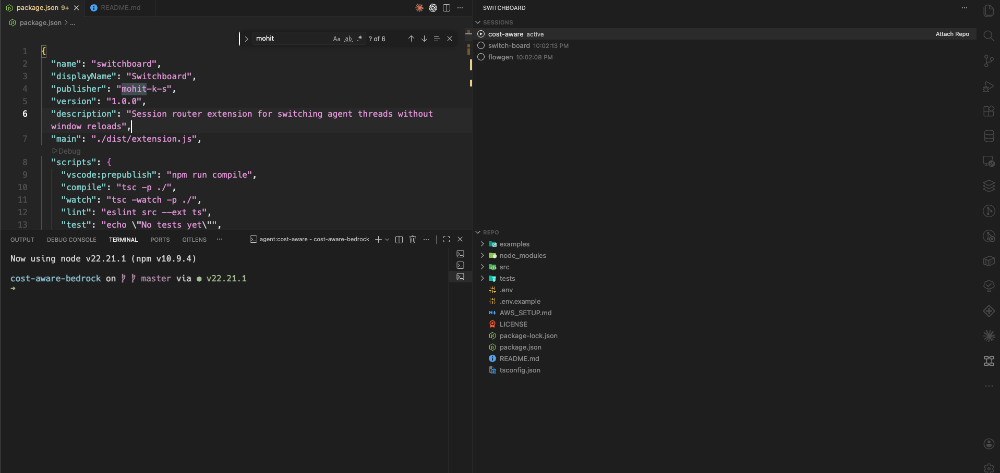

# Switchboard (VS Code Extension)

Switchboard is a lightweight VS Code extension that helps you switch between agent sessions/threads without reloading the window.



## What it does

- Session/thread switcher in a dedicated activity bar view
- Per-session repo tree in a custom explorer view
- Thread context panel in a webview
- Terminal handoff/focus command per active session

## Development

```bash
npm install
npm run compile
```

Run in VS Code:

1. Open this folder in VS Code
2. Press `F5` to launch an Extension Development Host
3. Open the **Switchboard** activity icon

## Install from GitHub Releases (VSIX)

1. Go to the repository **Releases** page.
2. Download the latest `switchboard-*.vsix` asset.
3. In VS Code, open Extensions view.
4. Click the `...` menu in the top-right of Extensions.
5. Select **Install from VSIX...** and choose the downloaded file.

You can uninstall later from the Extensions view (search for `Switchboard`), or via:

```bash
code --uninstall-extension mohit-local.switchboard
```
